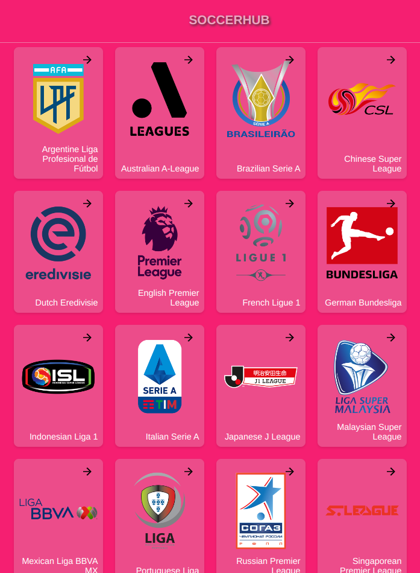

<div align="center">

  
  <br/>

  <h3><b>soccerhub</b></h3>

</div>

# 📗 Table of Contents

- [📗 Table of Contents](#-table-of-contents)
- [📖 Fullstack Development ](#-fullstack-development-)
    - [SoccerHub is your ultimate companion for all things football. Stay connected to the beautiful game like never before with our comprehensive app. Explore leagues, check live match scores, dive into in-depth team statistics, and get the latest football news from around the world—all in one place.](#soccerhub-is-your-ultimate-companion-for-all-things-football-stay-connected-to-the-beautiful-game-like-never-before-with-our-comprehensive-app-explore-leagues-check-live-match-scores-dive-into-in-depth-team-statistics-and-get-the-latest-football-news-from-around-the-worldall-in-one-place)
  - [🛠  Built With ](#--built-with-)
    - [Key Features ](#key-features-)
  - [💻 Getting Started ](#-getting-started-)
    - [Prerequisites](#prerequisites)
    - [Setup](#setup)
    - [Usage](#usage)
  - [👥 Authors ](#-authors-)
  - [🔭 Future Features ](#-future-features-)
  - [🤝 Contributing ](#-contributing-)
  - [⭐️ Show your support ](#️-show-your-support-)
  - [🙏 Acknowledgments ](#-acknowledgments-)
  - [❓ FAQ ](#-faq-)
  - [📝 License ](#-license-)


# 📖 Fullstack Development <a name="SoccerHub"></a>

### SoccerHub is your ultimate companion for all things football. Stay connected to the beautiful game like never before with our comprehensive app. Explore leagues, check live match scores, dive into in-depth team statistics, and get the latest football news from around the world—all in one place.

## 🛠  Built With <a name="built-with"></a>
- HTML
- SCSS
- JavaScript
- React
- Redux
### Key Features <a name="key-features"></a>
- [Live Demo Link](https://space-2cht.onrender.com)

<p align="right">(<a href="#readme-top">back to top</a>)</p>

## 💻 Getting Started <a name="getting-started"></a>

### Prerequisites

In order to run this project you need:

### Setup

Clone this repository to your desired folder:
```sh
  git clone https://github.com/sagieramos/soccerhub $HOME
```
### Usage

To run the project, execute the following command:

```sh
  cd $HOME/soccerhub
  npm install
  npm run build
  npm run start
```

<p align="right">(<a href="#readme-top">back to top</a>)</p>


## 👥 Authors <a name="authors"></a>
👤 **Stanley Osagie Ramos**
- GitHub: [@sagieramos](https://github.com/sagieramos)
- Twitter: [@sagieramos](https://twitter.com/sagieramos)
- LinkedIn: [LinkedIn](https://linkedin.com/in/sagieramos)

<p align="right">(<a href="#readme-top">back to top</a>)</p>


## 🔭 Future Features <a name="future-features"></a>

- [ ] **Add responsive layouts**

<p align="right">(<a href="#readme-top">back to top</a>)</p>

## 🤝 Contributing <a name="contributing"></a>

Contributions, issues, and feature requests are welcome!

Feel free to check the [issues page](https://github.com/sagieramos/soccerhub/issues).

<p align="right">(<a href="#readme-top">back to top</a>)</p>


## ⭐️ Show your support <a name="support"></a>

If you like this project, please consider subscribing to my GitHub account for updates and more projects

<p align="right">(<a href="#readme-top">back to top</a>)</p>


## 🙏 Acknowledgments <a name="acknowledgements"></a>
- Jehovah God
- [Microverse Team](https://www.microverse.org/).

<p align="right">(<a href="#readme-top">back to top</a>)</p>

## ❓ FAQ <a name="faq"></a>

- **Can I run this project run on Docker?**

  - yes

<p align="right">(<a href="#readme-top">back to top</a>)</p>

## 📝 License <a name="license"></a>

This project is [MIT](./LICENSE) licensed.

<p align="right">(<a href="#readme-top">back to top</a>)</p>

